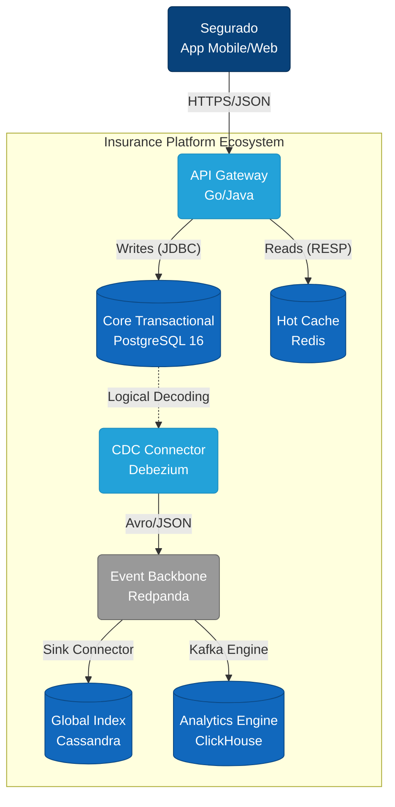

### Diagram A — Documentation & mapping

- Purpose: container-level view (C4 container) that shows runtime components and how they connect. Good for stakeholders and ops.
- What it represents: API (ingress), PostgreSQL as transactional core, Redis cache, Debezium CDC connector, Redpanda (Kafka API), Cassandra global index, and ClickHouse analytics.
- Mapping to repo:
    - `Postgres` → `src/database/00_init_schema.sql` (schemas, outbox, RLS)
    - `Debezium` → `infrastructure/insurance-outbox-connector.json` and the publication created in the SQL DDL
    - `Redpanda` / `Kafka` → referenced by `src/database/04_setup_click_house.sql` (ClickHouse Kafka engine) and connectors
    - `ClickHouse` → `src/database/04_setup_click_house.sql` (analytics DDL)
    - `Cassandra` global index → conceptual design in `docs/Challenger.md` (not implemented in `src/`)

