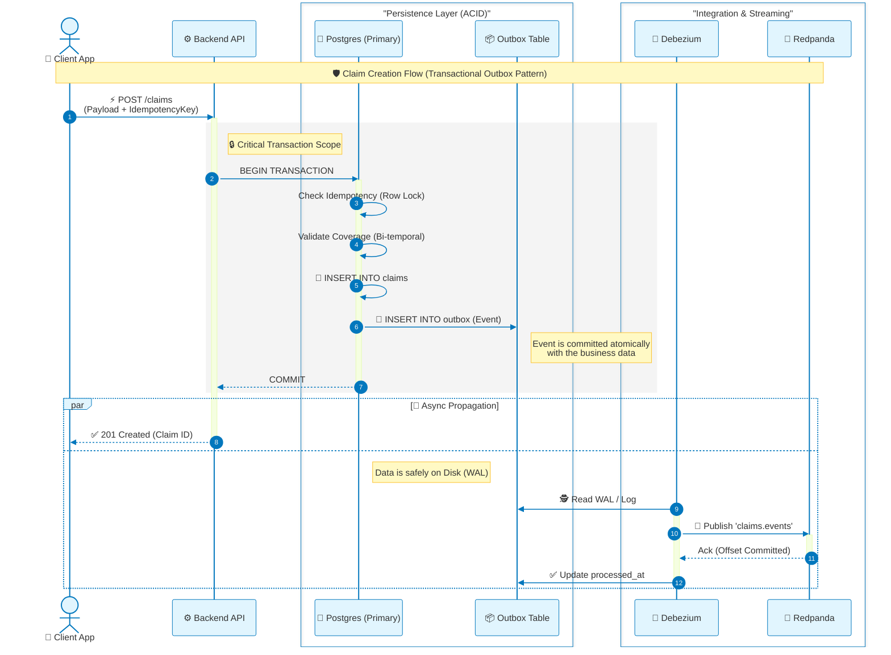

### Diagram B — Documentation & mapping

- Purpose: sequence diagram proving the "zero data loss" flow for a transactional operation, showing the outbox pattern and CDC propagation.
- What it represents: single request lifecycle from client → API → Postgres (writes state + outbox) → commit → Debezium reads WAL → publishes to Redpanda → outbox marked processed.
- Mapping to repo:
    - API behavior and transactional patterns are implied by `src/database/01_store_procedure.sql` (idempotency and business checks) and `00_init_schema.sql` (outbox table).
    - Debezium behavior is captured by the publication created in `00_init_schema.sql` and the connector payload in `infrastructure/insurance-outbox-connector.json`.

- Important clarifications / suggestions:
    - Debezium reads the WAL and publishes events, but Debezium itself does not typically update a `processed_at` column. In this repo there is a trigger `mark_outbox_processed()` that sets `processed_at` on update, but some outbox patterns rely on an external outbox poller to mark rows processed. Clarify which component updates `processed_at` (recommended: an outbox-ack service or consumer that acknowledges delivery).
    - Consider documenting idempotency semantics in the diagram: who holds the idempotency key (client) and where it's stored (claims table and event payload).
