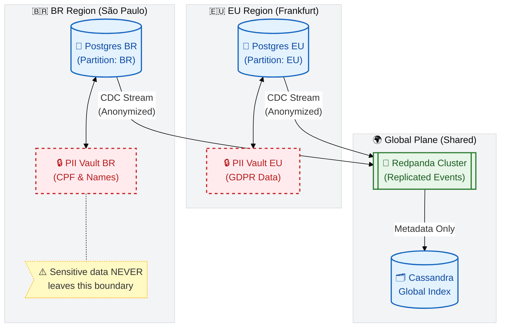

### Diagram C — Documentation & mapping (Data Sovereignty)

- Purpose: show regional sovereignty and that PII never leaves the home region.
- What it represents: per-region Postgres + local PII Vault and a global plane that carries non-sensitive metadata (events and indexes) into Redpanda and Cassandra.
- Mapping to repo:
    - `vault.customer_pii` and per-region partitions → `src/database/00_init_schema.sql`.
    - The "Metadata Only → Cassandra" arrow corresponds to the global index design in `docs/Challenger.md` (Cassandra `global_registry.policy_index`). Ensure only non-PII fields (policy_id, home_region, status) are propagated.
