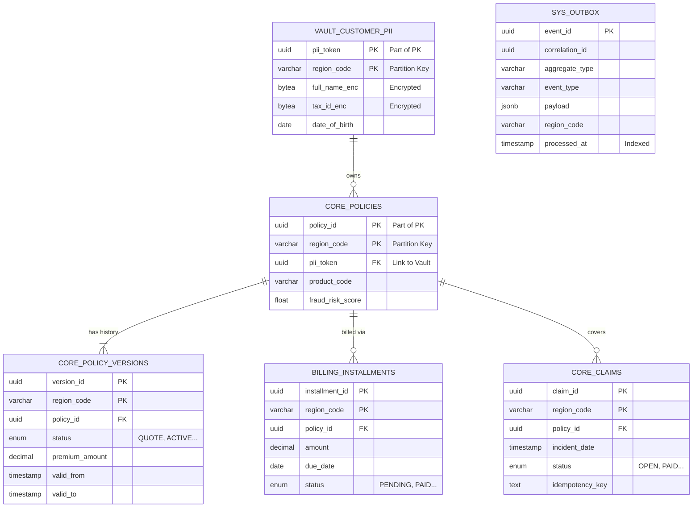

```mermaid
erDiagram
    %% ==========================================
    %% SCHEMA: VAULT (Sensitive Data)
    %% ==========================================
    VAULT_CUSTOMER_PII {
        uuid pii_token PK "Part of PK"
        varchar region_code PK "Partition Key"
        bytea full_name_enc "Encrypted"
        bytea tax_id_enc "Encrypted"
        date date_of_birth
    }

    %% ==========================================
    %% SCHEMA: CORE (Core Business)
    %% ==========================================
    CORE_POLICIES {
        uuid policy_id PK "Part of PK"
        varchar region_code PK "Partition Key"
        uuid pii_token FK "Link to Vault"
        varchar product_code
        float fraud_risk_score
    }

    CORE_POLICY_VERSIONS {
        uuid version_id PK
        varchar region_code PK
        uuid policy_id FK
        enum status "QUOTE, ACTIVE..."
        decimal premium_amount
        timestamp valid_from
        timestamp valid_to
    }

    CORE_CLAIMS {
        uuid claim_id PK
        varchar region_code PK
        uuid policy_id FK
        timestamp incident_date
        enum status "OPEN, PAID..."
        text idempotency_key
    }

    %% ==========================================
    %% SCHEMA: BILLING (Financial)
    %% ==========================================
    BILLING_INSTALLMENTS {
        uuid installment_id PK
        varchar region_code PK
        uuid policy_id FK
        decimal amount
        date due_date
        enum status "PENDING, PAID..."
    }

    %% ==========================================
    %% SCHEMA: SYS (Infrastructure / CDC)
    %% ==========================================
    SYS_OUTBOX {
        uuid event_id PK
        uuid correlation_id
        varchar aggregate_type
        varchar event_type
        jsonb payload
        varchar region_code
        timestamp processed_at "Indexed"
    }

    %% ==========================================
    %% RELATIONSHIPS (Cardinality)
    %% ==========================================
    
    %% A customer (PII) has 0 or many policies
    VAULT_CUSTOMER_PII ||--o{ CORE_POLICIES : "owns"

    %% A policy has 1 or many versions (history)
    CORE_POLICIES ||--|{ CORE_POLICY_VERSIONS : "has history"

    %% A policy generates 0 or many installments
    CORE_POLICIES ||--o{ BILLING_INSTALLMENTS : "billed via"

    %% A policy can have 0 or many claims
    CORE_POLICIES ||--o{ CORE_CLAIMS : "covers"

    %% The Outbox has no strict FK in the DB (decoupled), 
    %% but logically derives from Core transactions.
```