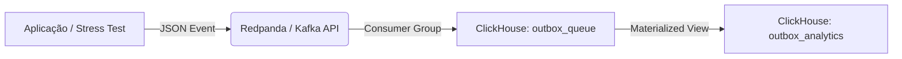

Excelente! Agora que validamos o fluxo completo (Aplicação -> Redpanda -> ClickHouse), vamos documentar isso de forma profissional.

Este `README.md` não serve apenas para você rodar o projeto, mas também conta como uma **documentação técnica de arquitetura**, explicando as decisões tomadas (como a mudança do formato JSON) e como o sistema se comporta sob estresse.

Aqui está a versão definitiva e atualizada:

---

# 🚀 Analytics & Ingestão de Alta Performance: ClickHouse + Redpanda

Este documento detalha a infraestrutura de dados projetada para o desafio de código. O objetivo é fornecer uma pipeline de ingestão robusta, capaz de suportar testes de carga (Stress Test) com processamento assíncrono via **Redpanda** e armazenamento analítico no **ClickHouse**.

## 🏗️ Arquitetura da Solução

O fluxo de dados segue o padrão **Store-and-Forward** para garantir que a aplicação transacional nunca seja bloqueada pela escrita analítica.



### Decisões Técnicas Importantes
1.  **Formato do Evento:** Optamos por **Flat JSON** (Evento de Domínio) ao invés de CDC (Debezium). Isso simplifica a carga útil e reduz o overhead de processamento no banco.
2.  **Engine Kafka:** O ClickHouse atua como um "Consumer" direto do Redpanda, eliminando a necessidade de ETLs externos (como Logstash ou Kafka Connect).
3.  **ReplacingMergeTree:** A tabela analítica lida automaticamente com eventuais duplicatas geradas por retentativas de rede, garantindo consistência eventual.

---

## 📂 Estrutura do Projeto

```text
/
├── database/
│   ├── 05_click_house_user.sql   # Schema (Tabelas e Views corrigidas para Flat JSON)
│   └── adm.xml                   # Configuração de Segurança e Performance
└── src/
    └── infrastructure/
        └── docker-compose.yml    # Orquestração
```

---

## 🛠️ 1. Configuração do Docker Compose

Arquivo: `src/infrastructure/docker-compose.yml`

*Nota: Removemos variáveis de ambiente de usuário para evitar conflitos com o XML de configuração.*

```yaml
version: '3.7'

services:
  analytical-db:
    image: clickhouse/clickhouse-server:latest
    container_name: insurance-clickhouse
    ports:
      - "8123:8123" # HTTP (UI, Integrações)
      - "9000:9000" # TCP (CLI, Alta Performance)
    ulimits:
      nofile:
        soft: 262144
        hard: 262144
    volumes:
      - clickhouse_data:/var/lib/clickhouse
      # Inicialização do Schema
      - ../../database/05_click_house_user.sql:/docker-entrypoint-initdb.d/01_init_clickhouse.sql
      # Configuração de Admin e Tuning
      - ../../database/adm.xml:/etc/clickhouse-server/users.d/adm.xml
    # depends_on:
    #   - event-bus # (Seu serviço redpanda)

volumes:
  clickhouse_data:
```

---

## 🔐 2. Configuração de Segurança e Tuning (XML)

Arquivo: `database/adm.xml`

Define o usuário `admin` e remove limites de memória para evitar que o banco mate queries pesadas durante o teste de stress.

```xml
<clickhouse>
    <users>
        <admin>
            <password>admin123</password>
            <networks>
                <ip>::/0</ip>
            </networks>
            <profile>default</profile>
            <quota>default</quota>
            <access_management>1</access_management> <!-- Permite criar tabelas Kafka -->
        </admin>
    </users>

    <!-- Tuning para Stress Test -->
    <profiles>
        <default>
            <max_memory_usage>0</max_memory_usage> <!-- Usa toda RAM disponível -->
            <max_execution_time>300</max_execution_time>
        </default>
    </profiles>
</clickhouse>
```

---

## 💾 3. Schema do Banco de Dados (SQL)

Arquivo: `database/05_click_house_user.sql`

Este script foi ajustado para ler o JSON "plano" gerado pela aplicação, mapeando campos como `event_id`, `payload` e `occurred_at` diretamente da raiz da mensagem.

```sql
CREATE DATABASE IF NOT EXISTS insurance;

-- 1. Tabela de Fila (Interface com Redpanda)
-- Mapeia EXATAMENTE as chaves do JSON enviado pela aplicação
CREATE TABLE IF NOT EXISTS insurance.outbox_queue
(
    event_id String,
    correlation_id String,
    aggregate_type String,
    aggregate_id String,
    event_type String,
    payload String,
    region_code String,
    occurred_at String
)
ENGINE = Kafka
SETTINGS
    kafka_broker_list = 'event-bus:9092',
    kafka_topic_list = 'insurance.sys.transactional_outbox',
    kafka_group_name = 'clickhouse_consumer_group',
    kafka_format = 'JSONEachRow',
    kafka_num_consumers = 1, -- Aumentar se o tópico tiver múltiplas partições
    kafka_max_block_size = 1048576; 

-- 2. Tabela Analítica Otimizada
CREATE TABLE IF NOT EXISTS insurance.outbox_analytics
(
    event_id UUID,
    correlation_id UUID,
    aggregate_type LowCardinality(String),
    aggregate_id UUID,
    event_type LowCardinality(String),
    payload String,
    region_code LowCardinality(String),
    occurred_at DateTime64(6),
    _ingested_at DateTime DEFAULT now()
)
ENGINE = ReplacingMergeTree(occurred_at)
PARTITION BY toYYYYMM(occurred_at)
ORDER BY (region_code, aggregate_type, event_type, occurred_at, event_id);

-- 3. Materialized View (ETL em Tempo Real)
-- Transfere dados da Queue -> Analytics fazendo o cast de tipos
CREATE MATERIALIZED VIEW IF NOT EXISTS insurance.mv_outbox_analytics
TO insurance.outbox_analytics
AS
SELECT
    toUUIDOrZero(event_id)         AS event_id,
    toUUIDOrZero(correlation_id)   AS correlation_id,
    CAST(aggregate_type, 'LowCardinality(String)') AS aggregate_type,
    toUUIDOrZero(aggregate_id)     AS aggregate_id,
    CAST(event_type, 'LowCardinality(String)')     AS event_type,
    payload                        AS payload,
    CAST(region_code, 'LowCardinality(String)')    AS region_code,
    -- Converte String ISO8601 para DateTime nativo
    parseDateTime64BestEffortOrNull(occurred_at)   AS occurred_at,
    now() AS _ingested_at
FROM insurance.outbox_queue;
```

---

## ✅ Como Verificar a Instalação

Após rodar `docker compose up -d`, utilize os comandos abaixo para validar o fluxo de dados.

### 1. Verificar Ingestão (Tabela Final)
Se você já enviou dados (seeds) para o Redpanda, eles devem aparecer aqui.
```bash
docker exec -it insurance-clickhouse clickhouse-client --user admin --password admin123 --query "SELECT count() FROM insurance.outbox_analytics"
```

### 2. Espiar os Dados
Para ver os últimos eventos processados:
```bash
docker exec -it insurance-clickhouse clickhouse-client --user admin --password admin123 --query "SELECT occurred_at, event_type FROM insurance.outbox_analytics ORDER BY occurred_at DESC LIMIT 5"
```

### 3. Debugar Conexão Kafka
Se a contagem for 0, verifique se o ClickHouse está conectado ao tópico:
```bash
docker exec -it insurance-clickhouse clickhouse-client --user admin --password admin123 --query "SELECT * FROM system.kafka_consumers"
```
*Se a coluna `last_exception` estiver preenchida, há um erro de rede ou configuração.*

---

## ⚡ Nuances e Solução de Problemas

Durante o desenvolvimento, identificamos cenários comuns que podem parecer erros, mas são comportamentos esperados:

### A. Tabela `outbox_queue` sempre vazia
**Sintoma:** `SELECT * FROM insurance.outbox_queue` retorna 0 linhas.
**Motivo:** O ClickHouse não armazena dados na Engine Kafka. Assim que o dado chega, a `Materialized View` consome o dado, insere na tabela final e descarta o original da memória.
**Solução:** Consulte sempre a `insurance.outbox_analytics`.

### B. Diferença de Formatos (JSON vs CDC)
**Contexto:** Inicialmente, o script esperava um formato CDC (com campos `before`, `after`, `op`).
**Ajuste:** Como a aplicação envia "Application Events" (JSON plano), ajustamos a tabela `outbox_queue` para mapear as chaves diretamente (ex: `event_id`, `payload`). Se o formato do JSON mudar, a tabela deve ser recriada (DROP/CREATE).

### C. Consistência em Stress Tests
**Cenário:** Durante carga alta, pode haver um pequeno atraso (lag) de milissegundos entre o Redpanda e o ClickHouse.
**Ajuste:** O parâmetro `kafka_max_block_size` controla o tamanho do lote. O ClickHouse insere em blocos para performance máxima, não linha a linha.

### D. Duplicidade de Dados
**Cenário:** O `count()` pode retornar mais linhas que o enviado se houver reprocessamento no Kafka.
**Solução:** Para relatórios exatos, use a query finalizadora que força a deduplicação:
```sql
SELECT count() FROM insurance.outbox_analytics FINAL
```